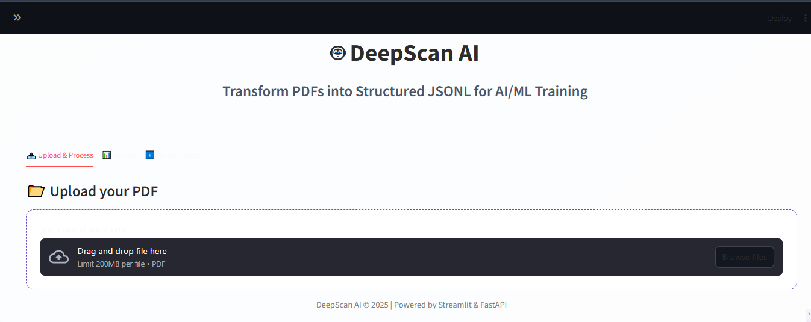
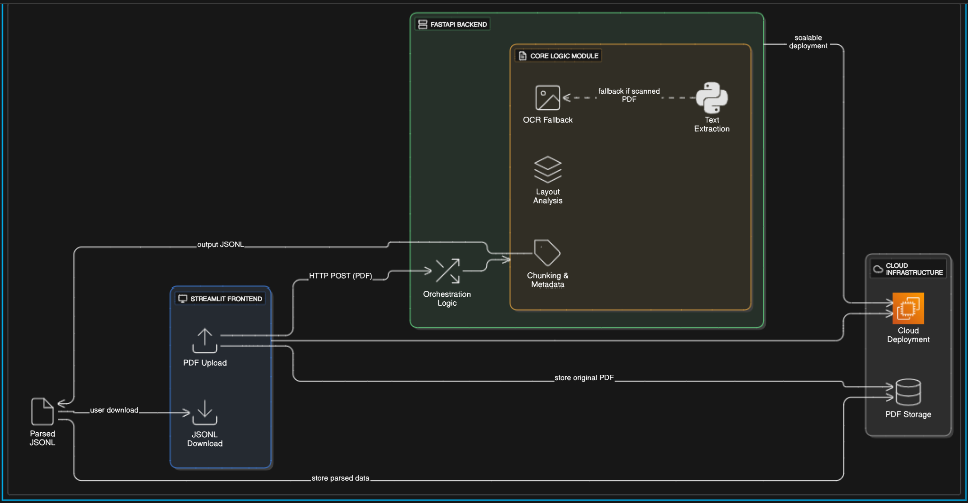

# DeepScan AI 🤖

**DeepScan AI** is a powerful tool designed to ingest and parse PDF documents, transforming them into a structured JSONL format, perfect for AI/ML model training and data analysis.

 
*Note: The screenshot is a representative example of a Streamlit application.*

---

## 📜 Overview

This project addresses the common challenge of extracting structured information from unstructured PDF files like research papers, reports, and articles. It provides a user-friendly web interface to upload a PDF, which is then processed by a robust backend service to identify and structure its contents (e.g., title, authors, abstract, sections).

The output is a clean, line-delimited JSON (JSONL) file, an ideal format for feeding into machine learning pipelines, fine-tuning large language models, or populating databases.


## ✨ Key Features

- **Intuitive Web Interface**: A modern, responsive UI built with Streamlit.
- **PDF to JSONL Conversion**: Seamlessly transforms complex PDFs into structured data.
- **Decoupled Architecture**: A Streamlit frontend communicates with a separate FastAPI backend for robust processing.
- **Data Preview**: Instantly view the structured JSON data within the app before downloading.
- **Easy Download**: Download the generated `.jsonl` file with a single click.
- **Configurable**: Easily change the backend API endpoint directly from the UI sidebar.

## 📐 System Architecture

The following diagram illustrates the overall architecture of **DeepScan AI**:



## 🛠️ Tech Stack

- **Frontend**: Streamlit
- **Backend**: FastAPI
- **API Communication**: requests
- **PDF Parsing (Backend)**: *(Assumed: Libraries like PyMuPDF, GROBID, or similar)*

## 📂 Project Structure

The project is organized into a frontend and a backend, promoting separation of concerns.

```
PDF-Ingestion-Parsing/
├── backend/
│   ├── main.py             # FastAPI application logic
│   └── requirements.txt    # Backend Python dependencies
├── frontend/
│   ├── app.py              # Streamlit application logic
│   └── requirements.txt    # Frontend Python dependencies
└── README.md
```

## 🚀 Getting Started

Follow these instructions to get a local copy up and running for development and testing purposes.

### Prerequisites

- Python 3.8+
- `pip` and `venv`

### Installation

1.  **Clone the repository:**
    ```bash
    git clone https://github.com/your-username/PDF-Ingestion-Parsing.git
    cd PDF-Ingestion-Parsing
    ```

2.  **Set up the Backend:**
    ```bash
    cd backend
    python -m venv venv
    source venv/bin/activate  # On Windows: venv\Scripts\activate
    pip install -r requirements.txt
    ```

3.  **Set up the Frontend:**
    (In a new terminal)
    ```bash
    cd frontend
    python -m venv venv
    source venv/bin/activate  # On Windows: venv\Scripts\activate
    pip install -r requirements.txt
    ```

### Running the Application

1.  **Start the Backend Server:**
    - Navigate to the `backend` directory.
    - Run the FastAPI server:
      ```bash
      # Make sure your backend virtual environment is activated
      uvicorn main:app --reload
      ```
    - The backend will be available at `http://127.0.0.1:8000`.

2.  **Start the Frontend Application:**
    - Navigate to the `frontend` directory.
    - Run the Streamlit app:
      ```bash
      # Make sure your frontend virtual environment is activated
      streamlit run app.py
      ```
    - Open your browser and go to the local URL provided by Streamlit (usually `http://localhost:8501`).

## Usage

1.  Ensure both the backend and frontend servers are running.
2.  Open the Streamlit application in your browser.
3.  On the **"📤 Upload & Process"** tab, drag and drop a PDF file or use the file selector.
4.  Click the **"🚀 Process PDF"** button.
5.  Once processing is complete, a success message will appear.
6.  Navigate to the **"📊 Results"** tab to preview the structured data and download the final `.jsonl` file.

## 🤝 Contributing

Contributions are what make the open-source community such an amazing place to learn, inspire, and create. Any contributions you make are **greatly appreciated**.

1.  Fork the Project
2.  Create your Feature Branch (`git checkout -b feature/AmazingFeature`)
3.  Commit your Changes (`git commit -m 'Add some AmazingFeature'`)
4.  Push to the Branch (`git push origin feature/AmazingFeature`)
5.  Open a Pull Request

## 📄 License

Distributed under the MIT License. See `LICENSE` file for more information.

## 🙏 Acknowledgments

- Made with ❤️ for our FYP by **Revotic-AI**.
- Powered by the incredible open-source communities behind Streamlit and FastAPI.
